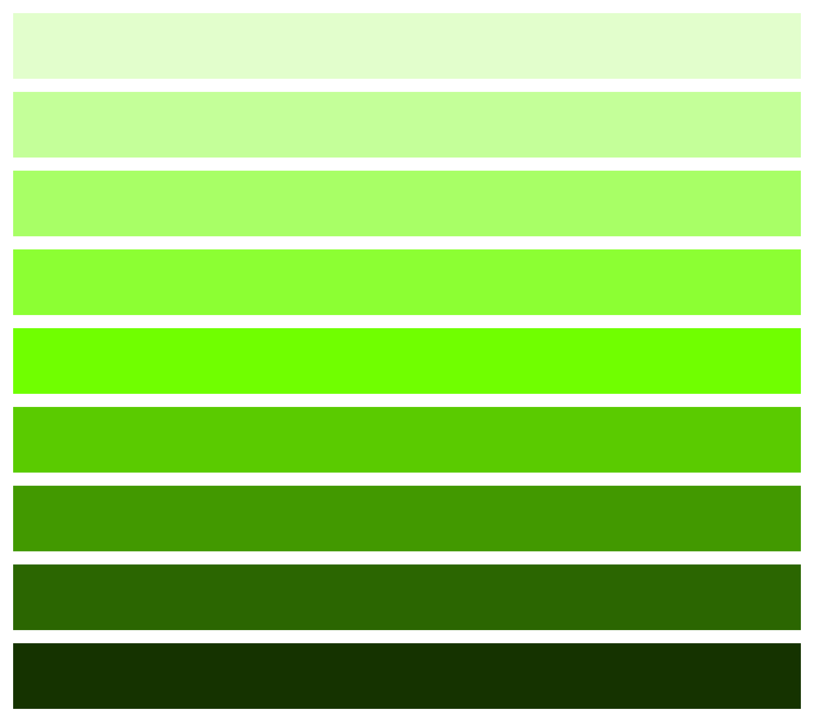
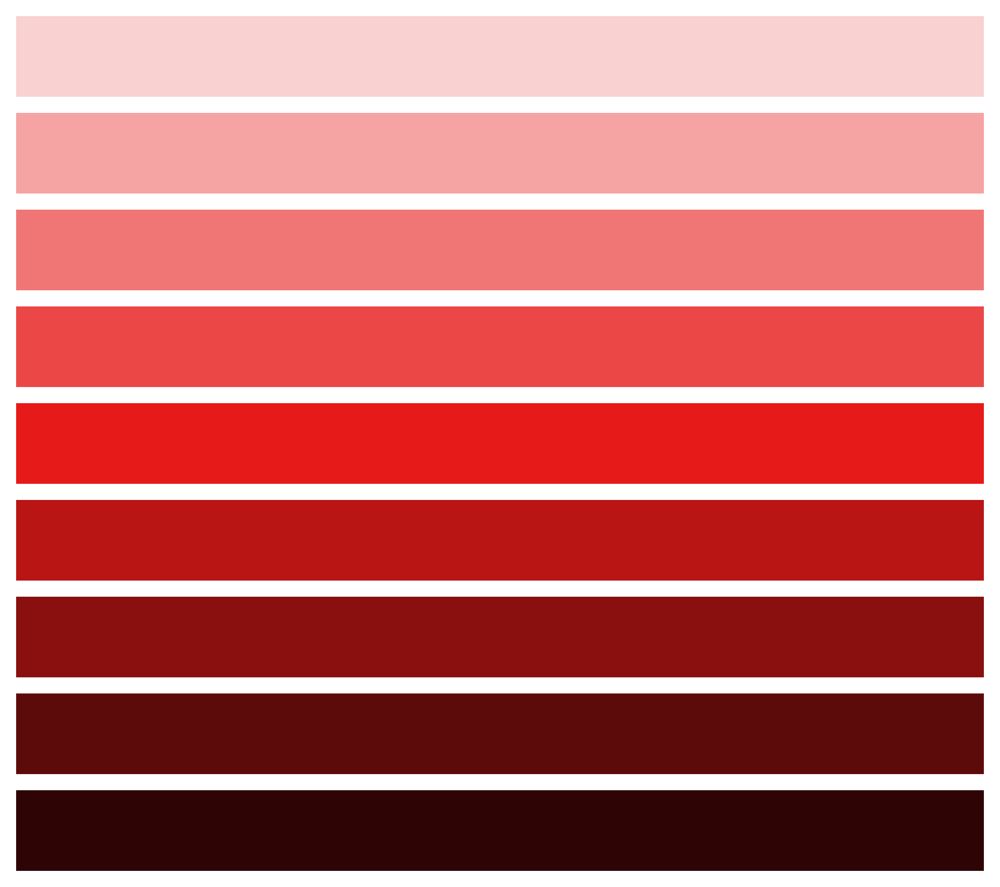

<!--
title:   CSSでカラーパレットを管理する際のアンチパターン
tags:    CSS,アンチパターン,色
id:      de880b8f687f13328c27
private: false
-->
## この記事の概要

CSSによるカラーパレット管理において、たまに見かけるけど**やめておいた方が良い**方法を記事にしました。

:::note warn
タイトルの「アンチパターン」は少し言い過ぎかもしれません。
しかし他に良い言い回しが浮かばなかったため、若干強い表現ですが使用しています。
:::

## やめた方が良い方法

以下の方法です。

- 色をHSLで扱い
- CSS custom propertiesに`h`, `s`, `l`それぞれを定義して
- `l`だけを変える

パッと見てもなんのことやらだと思うので、実際にコードを示します。

```css:style.css
/* 色の定義 */
:root {
  /* 色相と彩度の定義 */
  --color-hsl-h: 94;
  --color-hsl-s: 100%;

  /* 段階的な明度の定義 */
  --color-hsl-l-1: 90%;
  --color-hsl-l-2: 80%;
  --color-hsl-l-3: 70%;
  --color-hsl-l-4: 60%;
  --color-hsl-l-5: 50%;
  --color-hsl-l-6: 40%;
  --color-hsl-l-7: 30%;
  --color-hsl-l-8: 20%;
  --color-hsl-l-9: 10%;

  /* hsl()を用いて、同一色相同一彩度、明度変化のカラーパレット定義 */
  --color-primary-1: hsl(var(--color-hsl-h) var(--color-hsl-s) var(--color-hsl-l-1));
  --color-primary-2: hsl(var(--color-hsl-h) var(--color-hsl-s) var(--color-hsl-l-2));
  --color-primary-3: hsl(var(--color-hsl-h) var(--color-hsl-s) var(--color-hsl-l-3));
  --color-primary-4: hsl(var(--color-hsl-h) var(--color-hsl-s) var(--color-hsl-l-4));
  --color-primary-5: hsl(var(--color-hsl-h) var(--color-hsl-s) var(--color-hsl-l-5));
  --color-primary-6: hsl(var(--color-hsl-h) var(--color-hsl-s) var(--color-hsl-l-6));
  --color-primary-7: hsl(var(--color-hsl-h) var(--color-hsl-s) var(--color-hsl-l-7));
  --color-primary-8: hsl(var(--color-hsl-h) var(--color-hsl-s) var(--color-hsl-l-8));
  --color-primary-9: hsl(var(--color-hsl-h) var(--color-hsl-s) var(--color-hsl-l-9));
}

/* 上で定義した色を実際に使うとこういうイメージ */
.block1 {
  background-color: var(--color-primary-1);
}

.block2 {
  background-color: var(--color-primary-2);
}

.block3 {
  background-color: var(--color-primary-3);
}
```

コードを見る限りだと、なんだか良い感じに管理できているように見えるかもしれません。

しかし実際の見た目は以下のようになっています。



- 中間の色の彩度がやたら高く見える
  - 数値的には全て同じはずなのに
- 暗い側の最後の2色、変化が急

などこのままだとどうにも使いづらそうです。

また、色相や彩度を変えてみても同じようなパレットが生成されました。



## このアプローチのまま解消を目指すなら

- `l`だけでなく`h`や`s`も段階的に数値を用意する
- `l`の数値変化を等間隔でなく、実際の見た目に合わせて用意する

こういった調整を施せば多分使えるパレットは生成できると思います。

しかし、そうなるとh, s, lの組み合わせ数もかなり多くなりますから、HEX値を直接custom propertiesに登録してしまった方が楽な気もします。

## 何故こんなことが起きるのか

この分野の専門でないため若干説明が怪しいですが……

- 明度について
  - 人間の目が刺激を受け取る際、リニアではなく対数で処理している
    - ウェーバー・フェヒナーの法則
- 彩度について
  - マンセルの色立体を確認しても、中程度の明度が一番彩度方向に膨らんでいる
    - 明度が極端に高い場合や低い場合、割合としては彩度100%であっても取り得る絶対値がそもそも小さい

参考になりそうな記事も貼っておきます。

https://qiita.com/yoya/items/122b93970c190068c752

https://www.dic-color.com/knowledge/munsell.html

---

最後まで読んでくださってありがとうございます！
Twitterでも情報を発信しているので、良かったらフォローお願いします！

https://twitter.com/xrxoxcxox