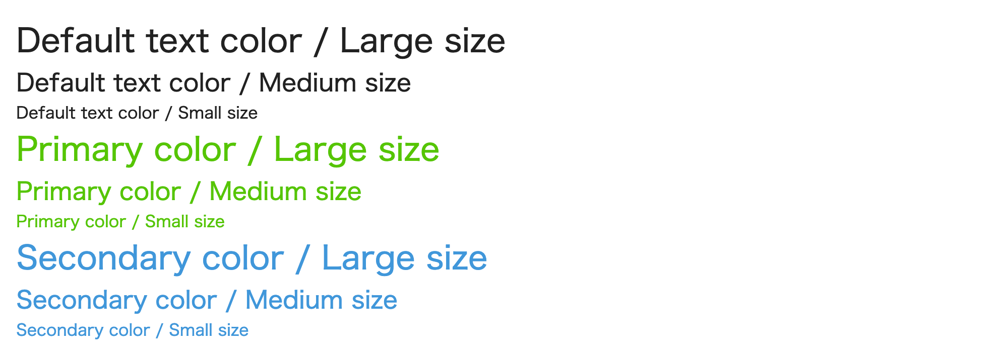

<!--
title:   Sassの変数は実体を持たない
tags:    CSS,Sass,Variables
id:      cd0651e7e83a02a53c0d
private: false
-->
## この記事の概要

Sassの変数とCSSのCustom Propertiesって何がどう違うの？という質問をたまに受けます。

私の中では一番重要なトピックである「実体を持つか持たないか」について記事にしました。

## 「実体」って何？

Sassの変数は

- `.sass`(または`.scss`)を書く際には存在している
  - 定義を変更すれば、全ての場所で使われている変数が呼応して変化する
- `.css`にコンパイルされた後はどこにも存在しない
  - 値を手動でコピペしたのと、なんら変わらないファイルが生成されている
  - 「実体がない」と呼んでいるのはこれを指す

「実体」の言葉選びが適切なのか分かりませんが、言いたいことは上記でほぼ全てです。

## コードを見てみる

適当な`.html`と`.scss`ファイルを用意しました。

```html:index.html
<!DOCTYPE html>
<html lang="ja">
  <head>
    <!-- 省略 -->
    <link rel="stylesheet" href="css/style.css" />
  </head>
  <body>
    <div class="container">
      <p class="large-text">Default text color / Large size</p>
      <p class="medium-text">Default text color / Medium size</p>
      <p class="small-text">Default text color / Small size</p>
      <p class="primary-large-text">Primary color / Large size</p>
      <p class="primary-medium-text">Primary color / Medium size</p>
      <p class="primary-small-text">Primary color / Small size</p>
      <p class="secondary-large-text">Secondary color / Large size</p>
      <p class="secondary-medium-text">Secondary color / Medium size</p>
      <p class="secondary-small-text">Secondary color / Small size</p>
    </div>
  </body>
</html>
```

`scss:style.scss
$text-color: rgba(0 0 0 / 0.87);
$primary-color: #55c500;
$secondary-color: #4097db;
$font-size-l: 32px;
$font-size-m: 24px;
$font-size-s: 16px;

* {
  margin: 0;
  padding: 0;
}

body {
  color: $text-color;
}

.container {
  margin: auto;
  padding: 16px;
  width: min(960px, 100%);
}

.large-text {
  font-size: $font-size-l;
}

.medium-text {
  font-size: $font-size-m;
}

.small-text {
  font-size: $font-size-s;
}

.primary-large-text {
  color: $primary-color;
  font-size: $font-size-l;
}

.primary-medium-text {
  color: $primary-color;
  font-size: $font-size-m;
}

.primary-small-text {
  color: $primary-color;
  font-size: $font-size-s;
}

.secondary-large-text {
  color: $secondary-color;
  font-size: $font-size-l;
}

.secondary-medium-text {
  color: $secondary-color;
  font-size: $font-size-m;
}

.secondary-small-text {
  color: $secondary-color;
  font-size: $font-size-s;
}
`

見た目はこのようになっています。



思った通りのスタイルを組めていますし、同じ値はSass変数を使って書けているので取り回しもしやすそうです。

ここでコンパイル後のCSSを見てみましょう。

```css:style.css
* {
  margin: 0;
  padding: 0;
}

body {
  color: rgba(0, 0, 0, 0.87);
}

.container {
  margin: auto;
  padding: 16px;
  width: min(960px, 100%);
}

.large-text {
  font-size: 32px;
}

.medium-text {
  font-size: 24px;
}

.small-text {
  font-size: 16px;
}

.primary-large-text {
  color: #55c500;
  font-size: 32px;
}

.primary-medium-text {
  color: #55c500;
  font-size: 24px;
}

.primary-small-text {
  color: #55c500;
  font-size: 16px;
}

.secondary-large-text {
  color: #4097db;
  font-size: 32px;
}

.secondary-medium-text {
  color: #4097db;
  font-size: 24px;
}

.secondary-small-text {
  color: #4097db;
  font-size: 16px;
}
```

同じ値を毎回コピペしたのと何ら変わりないファイルになっています。

## 逆に「実体」がある状態とは？

上記と同じスタイリングを、以下のようにも書けます。

```css:style.css
:root {
  --text-color: rgba(0 0 0 / 0.87);
  --primary-color: #55c500;
  --secondary-color: #4097db;
  --font-size-l: 32px;
  --font-size-m: 24px;
  --font-size-s: 16px;
}

* {
  margin: 0;
  padding: 0;
}

body {
  color: var(--text-color);
}

.container {
  margin: auto;
  padding: 16px;
  width: min(960px, 100%);
}

.large-text {
  font-size: var(--font-size-l);
}

.medium-text {
  font-size: var(--font-size-m);
}

.small-text {
  font-size: var(--font-size-s);
}

.primary-large-text {
  color: var(--primary-color);
  font-size: var(--font-size-l);
}

.primary-medium-text {
  color: var(--primary-color);
  font-size: var(--font-size-m);
}

.primary-small-text {
  color: var(--primary-color);
  font-size: var(--font-size-s);
}

.secondary-large-text {
  color: var(--secondary-color);
  font-size: var(--font-size-l);
}

.secondary-medium-text {
  color: var(--secondary-color);
  font-size: var(--font-size-m);
}

.secondary-small-text {
  color: var(--secondary-color);
  font-size: var(--font-size-s);
}
```

こちらであればDevToolsを使って定義にジャンプしたり、JavaScriptから値を取得して動的に書き換えたりも可能です。

「定義された値」としての実体を持っているため何かと便利です。

例えば、以下は私が書いた記事ですが、ダークモードUIを作るときもCustom Propertiesであれば比較的楽に実現できます。

https://qiita.com/xrxoxcxox/items/c4c6d6f2429dd6959727

## 最後に

若干Sassを悪く言ってしまった感もある記事ですがそうではありません。

それぞれの特性をしっかり理解しておくことが、そのときどきで一番良いアプローチを選べるはずと思って紹介しました。

オリジナル関数なんかは素のCSSでは作れませんし、適材適所で作っていけると良いなと思います。