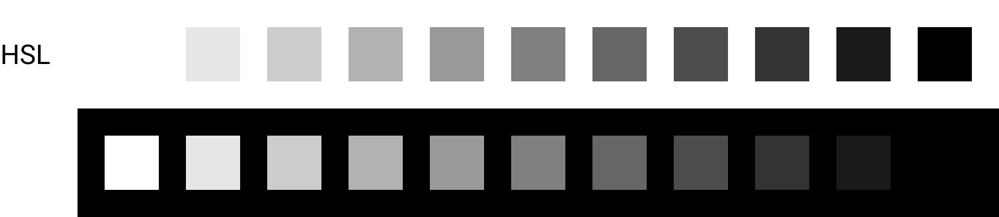
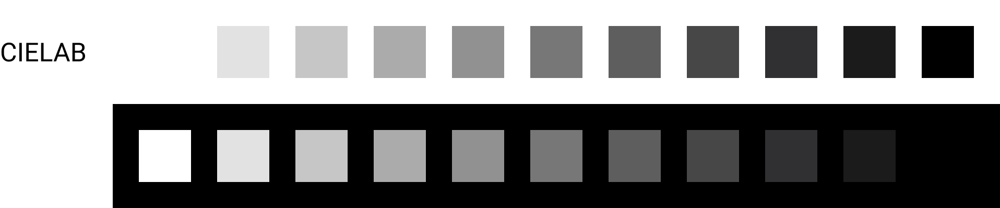
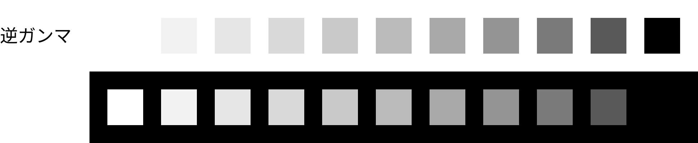
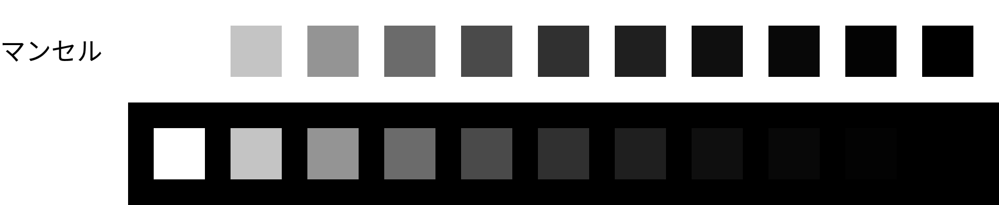
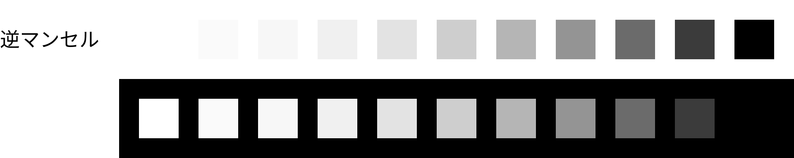
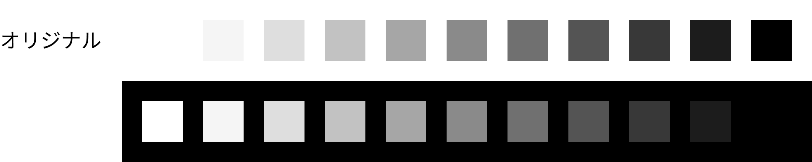
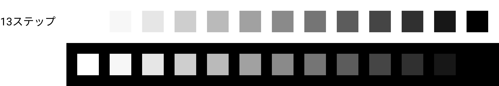
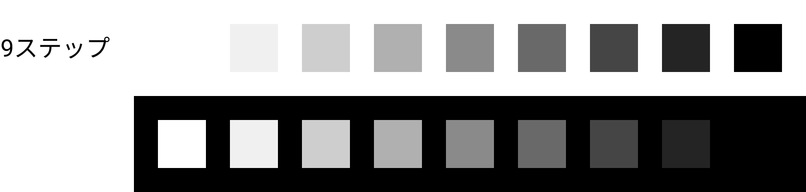

<!--
title: UIのカラーパレットとして綺麗なグレーのグラデーションを考える
tags: CSS,修正マンセル表色系,色,CIELAB
-->
## この記事の概要

CSSでグラデーションを作ろうとして「RGBを同じ値だけ足していけば綺麗なグレーのグラデーションになるだろう」と思ったことはありませんか？
筆者も過去にやって「理屈の上ではあってるはずなのに……」と首をかしげていました。

今回は色々と試行錯誤し、一旦はそれらしいグラデーションを作ることができました。
知識として正しい記事なのか若干怪しいですが、将来のどなたかの参考になればと思い投稿します。

:::note warn
私自身この分野に詳しいわけではないので、より詳しい方がいたら是非コメントをお願いします :pray:
:::

## HSL

RGBの組み合わせだと人間が色味を想像しづらいということで色相(Hue)、彩度(Saturation)、輝度(Lightness)の組み合わせで表現したHSLというものがあります。

明るさを表す`L`の値を、100から0まで10刻みで用意しました。
背景には`#fff`と`#000`を敷いています。



黒背景では綺麗なグラデーションに見えますが、白背景だと1段階目のグレー（HEXで言うと`#e6e6e6`）がかなり暗い印象です。

例えばAppleの[Human Interface GuidelinesにおけるColorsの説明](https://developer.apple.com/design/human-interface-guidelines/ios/visual-design/color/)を見ると、6段階あるグレーのうち最も明るいものは`#f2f2f7`でした。

白背景時、もう少し良い見え方にできないか……と悩みます。

## CIELAB

`CIE L*a*b*`は肉眼での見え方にかなり近いとのことだったので、試してみました。
`L`の値を100から0まで10刻みで用意しました。



こちらもHSLのときの結果とほぼ同じです。

## ガンマ補正の逆をかける

https://qiita.com/yoya/items/122b93970c190068c752

こちらの記事の中にある「デメリット」を読んでいたところ、以下の記載がありました。

> 100 と 0 の真ん中の輝度が欲しい時、そのまま計算すると50ですが、本当の輝度平均は 73 辺りです。50 の値で表示すると輝度が20%程になる事を示しています。
実際の輝度よりも相当暗くなります。

先ほどまで試した2つのグラデーションで、明るいはずのグレーがかなり暗く見えるのはこれが原因か？と思い試してみました。

本当は微妙に違いますが、sRGBの場合ガンマはほぼ2.2なので、`Math.pow(x, 1/2.2)*100`で先ほどまでと同様に11段階の結果を得ると……

```
0
35.111917342151315
48.11565050522864
57.85326090814171
65.93532905028938
72.9740052840723
79.27927305474223
85.03349277020303
90.35454309190943
95.32375475512687
100
```

この値をHSLのLに当てはめてみると以下のようになりました。



明るい方のグレーは綺麗ですが、暗い側から2番目のグレーが唐突過ぎます。

## 修正マンセル表色系

マンセルの式で表すとどうなるのでしょう。
最早理解の範疇を超えていますが、式としてはこうなっているようです。

`(1.1914*V)-(0.22533*(V**2))+(0.23352*(V**3))-(0.020484*(V**4))+(0.00081939*(V**5))`

```
0
1.17992539
3.04811648
6.3911777700000005
11.700751359999998
19.271843750000002
29.301152640000005
41.98539373
57.61962752000001
76.69558611000002
100.00000000000004
```

数値を見た瞬間に「これは違うだろ」と思いましたが、一応試してみます。



流石に違いましたね。


## 修正マンセル表色系の逆

ガンマの逆をかける、という発想から、特に根拠は無いですが試してみました。



思いつきでやったにしては白背景でのグラデーションは良い感じです。
しかし黒背景のとき、1つ目のグレーが急ですね。

## 悩み悩んでオリジナル

```
y = - 0.012x^12 + 1.09x
```

手作業でちまちまと確認しながら作った式なので、係数の導出に理論はありません。気合いです。

これまでと同様に11ステップの色が欲しいとしたら



なんとなく良さそうです。
数値的には以下です。

| 見かけ上の明るさ | HSLのLの値 |
| --: | --: |
| 0 | 0 |
| 10 | 11 |
| 20 | 22 |
| 30 | 33 |
| 40 | 44 |
| 50 | 55 |
| 60 | 65 |
| 70 | 76 |
| 80 | 87 |
| 90 | 96 |
| 100 | 100 |

2ステップずつ増減させてみました。




結構良いのではないでしょうか。
式が全然美しくないこと以外は問題なく使える気がします。

## 参考文献

- マクセルフロンティア株式会社 . “HSLの色表現” . 画像認識の技術ブログ . 2021 . https://www.frontier.maxell.co.jp/blog/posts/32.html , (参照 2022-03-05)
- Yoshihiro Yamazaki . “ガンマ補正のうんちく” . Qiita . 2021 . https://qiita.com/yoya/items/122b93970c190068c752 , (参照 2022-03-05)
- ［色彩工学/カラーサイエンス］YoshiColor . “色を科学する　その⑪ 均等色空間と色差＜中編＞ 「log」や「べき」で明るさを表す” . note . 2021 . https://note.com/yoshicolor/n/n812c204a0e62 , (参照 2022-03-06) .
- 一般財団法人日本色彩研究所 . “＜研究2部報＞マンセル明度関数の係数について” . 一般財団法人日本色彩研究所 . 2017 . https://www.jcri.jp/JCRI/hiroba/COLOR/buhou/166/166-4.htm , (参照 2022-03-06) .