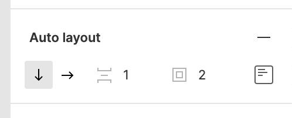
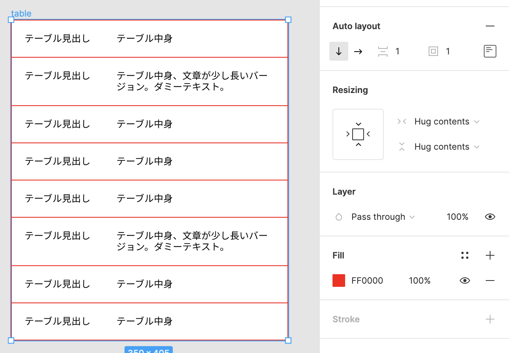

<!--
title:   Figmaで表組みを作るときに少し時短できる方法
tags:    Design,figma,デザイン
id:      024d8b17d84962a46c39
private: false
-->

## この記事の概要

UIデザインツールで表組みを再現すると地味に大変ですよね。
区切り線や枠線などを細かめに用意せねばならず、並び変えや要素変更も思ったより時間がかかるというか……。

というわけで、若干ですが表組みを作るのが楽になるやり方を紹介します。

:::note warn
Inspectで見ると訳のわからないデータにはなっているので、実装者との連携は必須な作り方です。
独断でやると「これ、どういうこと？」となってしまいかねませんのでご了承ください。
:::

## 作り方

1. HTMLでいう`tr`に相当する要素を作る
1. それらをAuto layoutで並べる
1. `Spacing between items`や`Padding around items`にボーダーとして適用したい数値を入れる
   1. 例：区切り線1px、外枠2pxだったら
   1. 
1. 完成
   1. 

## メリット

通常の作り方だと、例えば`tr`に相当する要素と区切り線を両方作るとオブジェクト数が多くなります。
また要素を並び変えしたいときにtrと区切り線をどちらも選択しないといけなくて、本当にわずかですが手間が増えます。

今回の作り方であれば上記両方が解消されます。

## 実際のデータ

こちらからどうぞ！

https://www.figma.com/file/W0HG4oe02u0mg7fQ59r8ZY