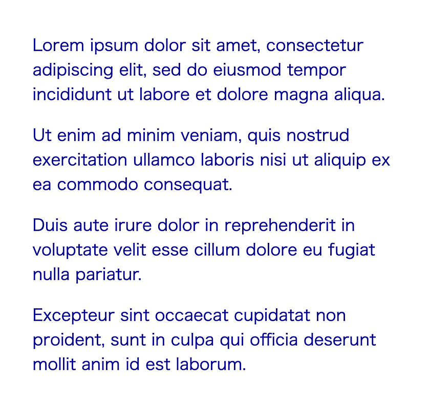

<!--
title:   @layerを使ったCSS設計を考えていたら少しだけハマった話
tags:    CSS,CSS設計
id:      a021052b0db4c6f5cb02
private: false
-->


## この記事の概要

CSSに`@layer`が登場したことにより、これまでより柔軟にコードを書けそうです。
まだEdgeが対応できていないため本番適用するのは時期尚早ですが、そう遠くないと思います。

というわけで今のうちから「これからのCSS設計」を考えるか〜と素振りしていたわけですが、少しだけハマった箇所があり記事にしました。

## @layerの簡単な説明

使い方や効果は以下のようなイメージです。

1. レイヤーを定義して、その中でスタイルを書く
1. レイヤーの順番を定義する
1. どれだけ詳細度が高くても、後のレイヤーのスタイルには勝てない
1. 詳細度の問題で適用されないスタイルをハック的に解消する必要がなくなる

詳しくはMDN Docsが分かりやすいです。

https://developer.mozilla.org/ja/docs/Web/CSS/@layer

## 今回ハマった問題

### 当初考えていたこと

1. `@layer`があれば`reset.css`みたいなものにやたら詳細度の高いスタイルを書いたとしても大丈夫ってこと？
1. `reset`みたいなレイヤーを作るのと、無名で宣言しておくの、どちらが使い勝手が良いんだろう？

1番目の考え、`reset.css`に詳細なスタイルなんか書くもんじゃないと思いつつ……。
例えばQiitaの場合は、記事ページにおいて`.it-MdContent`クラスの直下にある`p`要素は`line-height`がいくつで……といった指定がされています。
MarkdownからプレーンなHTMLに変換していて、各要素にクラス名がついていない関係での指定です。
記事系のサイトだとこういう作りになっている場合も多いんじゃないでしょうか？

というわけで一応検証対象としていました。

### 想定通りに動かなかったコード

先ほどの2番目の考えにおいて、まずは無名レイヤーで試してみようと書いてみました。

```html:index.html
<div class="container">
  <p class="text">
    Lorem ipsum dolor sit amet, consectetur adipiscing elit, sed do eiusmod
    tempor incididunt ut labore et dolore magna aliqua.
  </p>
  <p class="text text-alternate">
    Ut enim ad minim veniam, quis nostrud exercitation ullamco laboris nisi
    ut aliquip ex ea commodo consequat.
  </p>
  <p class="text">
    Duis aute irure dolor in reprehenderit in voluptate velit esse cillum
    dolore eu fugiat nulla pariatur.
  </p>
  <p class="text">
    Excepteur sint occaecat cupidatat non proident, sunt in culpa qui
    officia deserunt mollit anim id est laborum.
  </p>
</div>
```

```css:style.css
@layer alternate;

.container .text {
  color: darkblue;
}

@layer alternate {
  .text-alternate {
    color: darkgoldenrod;
  }
}
```

| 想定していた表示 | 実際の表示 |
| --- | --- |
|  |  |

### 動かなかった原因

先ほど貼ったMDN Docsをよく読みなおしてみました。
記載してあった場所を引用します。

> 単純な例
>
> 次の例では、 2 つの CSS ルールが作成されています。 1 つはレイヤーの外にある `<p>` 要素に対して、もう一つは .box p に対して type というレイヤーの内側にあります。
>
> レイヤーがなければ、セレクター .box p が最も高い詳細度を持つので、テキスト Hello, world! は緑色で表示されます。 type レイヤーはレイヤー以外のコンテンツを保持するために作成された無名レイヤーの前にあるため、テキストは紫色で表示されます。
>
> また、順序にも注意してください。レイヤー以外のスタイルを最初に宣言しても、それはレイヤーのスタイルの後に適用されます。

```html:HTML
<div class="box">
  <p>Hello, world!</p>
</div>
```

```css:CSS
p {
  color: rebeccapurple;
}

@layer type {
  .box p {
    font-weight: bold;
    font-size: 1.3em;
    color: green;
  }
}
```

自分を擁護する感じになって申し訳ないですが、この記載を読んでも最初は理解できていませんでした。
（英語版の記載の方が分かりやすかったため後で別な訳をPull Requestとして出そうかな……とも思っています。）

動きとしては`レイヤーとして宣言していないスタイル`はどのレイヤーよりも優先度が高く扱われます。
最後に宣言したのと同じ扱いですね。

### 動くようになったコード

```css:style.css
@layer base, alternate;

@layer base {
  .container .text {
    color: darkblue;
  }
}

@layer alternate {
  .text-alternate {
    color: darkgoldenrod;
  }
}
```

これらの検証の結果`reset.css相当のスタイルを無名で扱う`アプローチはそもそも実施不可だと分かりました。

## まとめ

最終的には筆者の読解力の問題で理解できていなかっただけなのですが、未来の誰かのためになれば幸いです。

また`@layer`は新しいものなのでこれからも動きが変わるかもしれません。
実務で使う際は最新の仕様をチェックしてください。
実際、[こちらのIssueのコメント](https://github.com/w3c/csswg-drafts/issues/6284#issuecomment-937262197)にあるように、以前は`レイヤーとして宣言していないスタイル`は最も低い優先度だったようです。