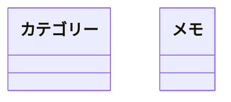
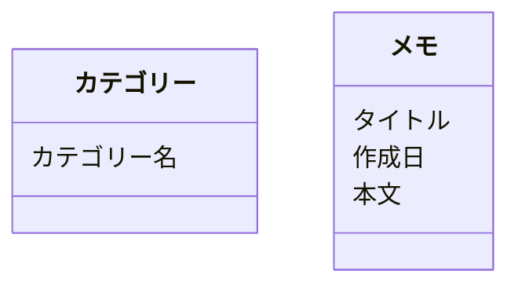
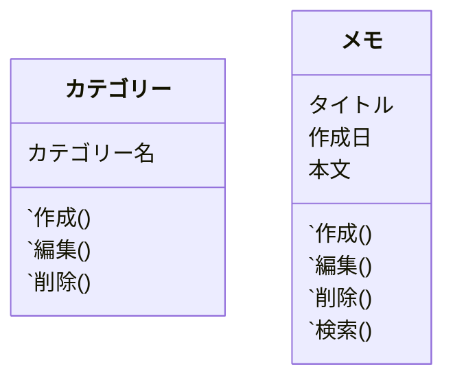
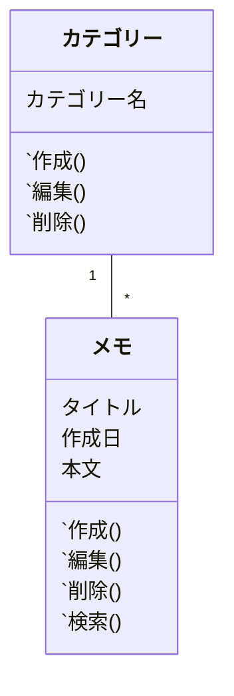

<!--
title:   クラス図をUIデザインの際にも書く
tags:    Design,uml,クラス図,デザイン
id:      019231958ee1f3d5bf5d
private: false
-->
## この記事の概要

私はデザイナーなのですが、普段ある程度のコードを書きます。
多少なりともコードを書いていると「デザインにもエンジニアリングの概念を持ち込むと便利そう」と思う機会が多くあります。

というわけでUIデザインをする際にクラス図も一緒に書いていく流れを記事にしてみました。
なお、クラス図を書くにしてもFigmaやSketch上で整理すると検索性が悪いとか、データとしての扱いが大変かもしれないとか、そんな考えもありこの記事ではMermaid[^1]で記載しています。

[^1]: Mermaidとは、テキストとコードを使ってダイアグラムやビジュアライゼーションを作成できるツールです。[最近Qiitaでも使えるようになった](https://qiita.com/release-notes#mermaidによるダイアグラムの表示をベータ版として公開しました)ので、それを試す意味合いもあります。

## 題材

ごく簡単なメモアプリを考えてみます。

### 要件を整理する

- メモが書ける
- メモが編集できる
- メモが削除できる
- メモを検索できる
- カテゴリーを作成できる
- カテゴリーを編集できる
- カテゴリーを削除できる
- メモをカテゴリーに紐付けられる

あまりにも簡素ですが、上記の内容で考えます。

### オブジェクトを拾い上げる

[OOUI本](https://www.amazon.co.jp/dp/B0893RK6WC/)や大元の[ソシオメディアさんの記事](https://www.sociomedia.co.jp/7279)にもあるように、まずは名詞を拾い上げます。

- カテゴリー
- メモ

簡単な例ですからここで出てくる要素が少ないのも当然です。
今回はこの2つがメインです。

というわけで、現時点ではこう。

### オブジェクトの要素を考える

カテゴリーにはカテゴリー名だけ。
メモにはタイトルと作成日と本文があるとしましょう。

それぞれの要素を並べただけです。特に難しいことはないでしょう。

### それぞれのオブジェクトに対してできるアクションを考える

要件で出していた内容がかなり近いです

- カテゴリー
    - 作成
    - 編集
    - 削除
- メモ
    - 作成
    - 編集
    - 削除

### オブジェクト同士の関係性を考える

1つ1つのオブジェクトは整理できましたから、後は関係性を考えます。

- 1つのカテゴリーは0以上のメモをもつ
- 1つのメモは1つのカテゴリーに属す

### UIを作る

ここまでで考えた内容で、見た目としてはだいたい作れるようになっていると思います。
試しに作ってみました。

メモの本文の編集はモードレスにとか、ハンバーガーメニューの中にアクションをまとめようとか、漏れなく考えやすいと思います。

:::note warn
あくまで例なので、ハンバーガーメニューの使用の是非はおいておいてください。
:::

### 1度見た目にすると気付くものを付け加える

例えば、先ほどの仕様では`1つのメモは1つのカテゴリーに属す`とあったので愚直にモックアップにおこしてみましたが`すべてのカテゴリー`のような形式で見れるビューが無いと不便そうだぞ？など

また、今回は文字列か日付かくらいしかありませんでしたが、真偽値や数字など色々なパターンをとるのであればそれもクラス図に書いていく方が良いでしょう。

## 最後に

例がかなり簡単なのでクラス図を作らずとも問題無い感じも否めませんが、ひとまず世の中にこういう作り方を共有してみます。

- UIを作るときにクラス図を考えておけると便利
    - かなり簡単な内容しか書いていなくても、要素の整理に使える
- エンジニアとデザイナーの（ほぼ）共通言語として使えるまでになれば「お互いが思っていた構成が違った」ような悲劇も防ぎやすい

---

最後まで読んでくださってありがとうございます！
Twitterでも情報を発信しているので、良かったらフォローお願いします！

https://twitter.com/xrxoxcxox