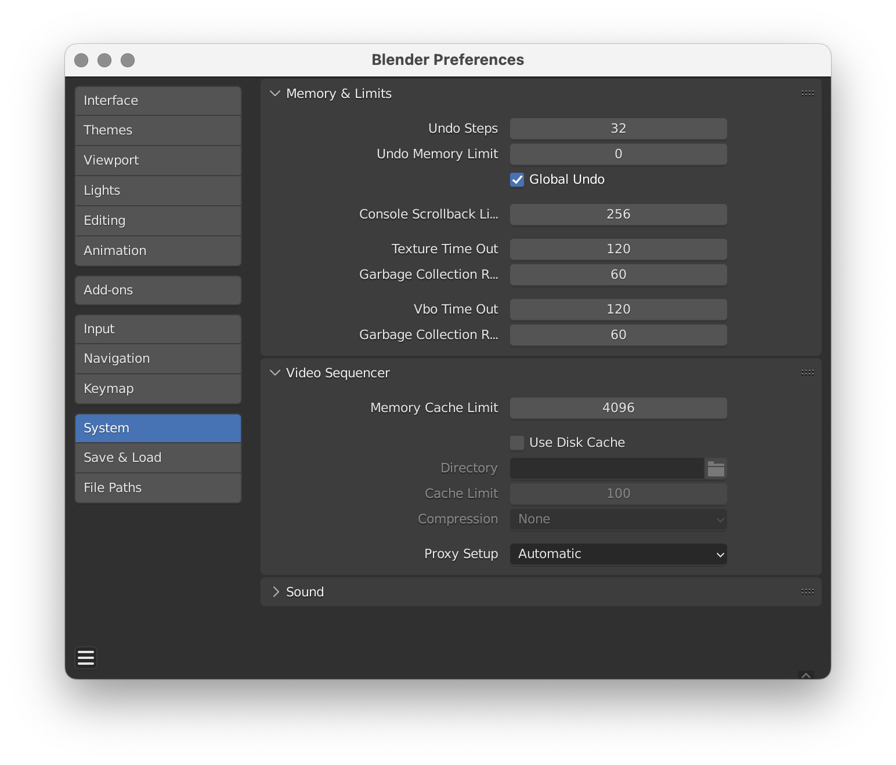
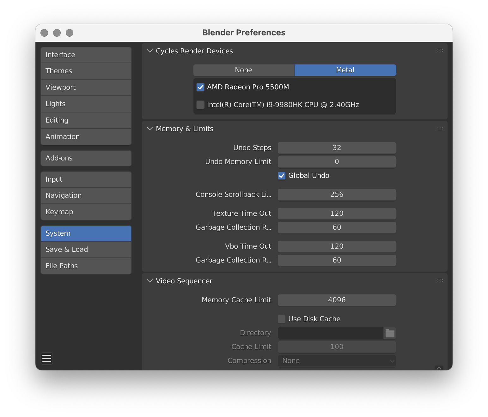
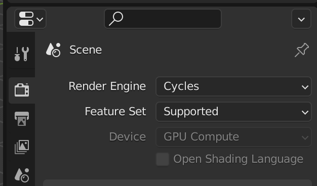
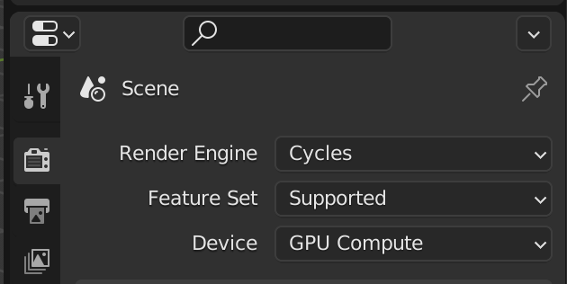

<!--
title:   MacでもBlenderでGPUレンダリングができるようになっていたので比べてみた
tags:    Design,デザイン,3dcg,Blender
-->

## この記事の概要

ここ最近のBlender[^1]は、MacではGPUレンダリングができませんでした。[^2]

[^1]: [公式マニュアル](https://docs.blender.org/manual/en/2.90/render/cycles/gpu_rendering.html)を辿ってみたところ、2.90からは`GPU rendering is only supported on Windows and Linux; macOS is currently not supported.`と記載されていました。

[^2]: NVIDIAのeGPUを使用すればできたらしいですが、私は試したことがありません。

しかし、2022年3月9日にリリースされたバージョン3.1ではGPUレンダリングが可能になったようです。
ということでUIやレンダリング時間を比較してみた記事です。

:::note warn
今回の内容は

- macOS 12.2以上のM1 Mac
- macOS 12.3以上でAMDのグラフィックカードを積んでいるMac

のどちらかの条件を満たさないといけません。

詳しくは公式のリリースノートをご覧ください。
https://wiki.blender.org/wiki/Reference/Release_Notes/3.1/Cycles
:::

## 環境

| カテゴリー | 内容 |
| --- | --- |
| マシン | MacBook Pro (16-inch, 2019) |
| OS | macOS Monterey (12.3) |
| プロセッサ | 2.4 GHz 8-Core Intel Core i7 |
| メモリ | 64 GB 2667 MHz DDR4 |
| グラフィックス | AMD Radeon Pro 5500M 8 GB |

MacBook Pro単騎で3DCGに挑むなんて……という声が聞こえてきますが、これでやっています。
## 設定画面

多くの人が使っているであろう2.93(LTS)と比較してみます。

 | 2.93 | 3.1 |
 | --- | --- |
 |  |  |

`Preferences > System` に `Cycles Render Devices`という項目が追加されています。

ここで`Metal`のタブを選び、使用したいGPUを選べばOKです。

## Scene設定

 | 2.93 | 3.1 |
 | --- | --- |
 |  |  |

3.1までは`GPU Compute`を選んでもグレーアウトしてしまい、意味はありませんでした。
3.1ではちゃんと選べるようになっています。

余談ですが、3.1では`Open Shading Language`のチェックが消えているのは、この項目がCPUレンダリング時限定のオプションだからです。

詳しくはこちらのマニュアルをご覧ください。

https://docs.blender.org/manual/en/latest/render/shader_nodes/osl.html

