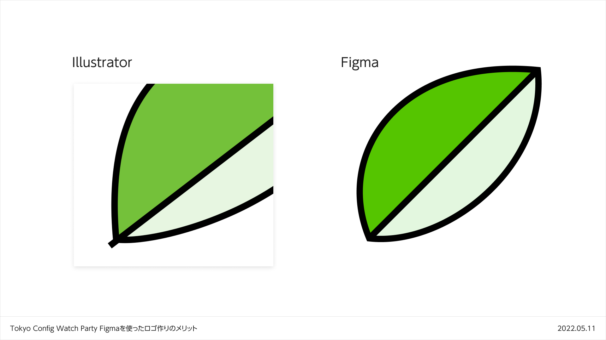

<!--
title:   Figmaを使ったロゴ作りのメリット（Tokyo Config Watch Party とっておきFigmaの活用策をシェアしよう！）
tags:    Figma,tips
-->

## この記事の概要

2022年5月11日開催の[Tokyo Config Watch Party](https://configtokyo.splashthat.com/)にてLT枠があり、そこで話す内容です。

記事投稿時点ではイベントはまだ開催されていませんが、先んじて公開します。

なお、自分の台本をそのまま記事化しているので書き言葉として最適化されていません。
ご了承ください。

## 内容

### はじめに

みなさん初めまして。

`とっておきFigmaの活用策をシェアしよう！`ということで、私からはFigmaを使ってロゴ作成をするメリットについてお話します。

はじめに自己紹介ですが、Qiita株式会社でデザイナーをしている綿貫佳祐です。

Qiitaはエンジニアのための情報共有サービスで、このLTの内容もQiitaに投稿しています。

普段のUI作成はほぼ全部Figmaで完結しているんですが、ロゴすらもFigmaで作るときがあります。

Adobe Illustratorでなく、あえてFigmaを選ぶ理由がいくつかあって、今日はその話をします。

大きく分けると4つのメリットがあります

- 整数座標へのスナップの容易さ
- 1つのアンカーポイントから複数のパスが生やせる
- スムースコーナーが簡単に作れる
- リファレンスとの行ったり来たりが楽

### 整数座標へのスナップの容易さ

本題に入るのが遅くなってしまいましたが、ここから具体的な話をしていきます。

まず、整数座標へスナップするのが簡単です。

Illustratorでもできるんですが`ピクセルグリッドに整合`系のオプションを有効にするとか、アートボード座標にまで気を配るとか、地味に見る箇所が多いです。

対してFigmaは、当たり前なんですが、基本的には何も考えなくてもピクセルにスナップします。

あと、これはほとんど趣味なんですが……。

アンカーポイントもハンドルもちゃんと整数座標に乗っていると、書き出されるSVGをコードとして見たときも綺麗です。

最終的なコードへの出力を意識してロゴを作ってしまう性質の人間なので、ここがやりやすいのは自分にとってはメリットです。

### 1つのアンカーポイントから複数のパスが生やせる

次は、1つのアンカーポイントから複数のパスが生やせる点です。

これは今日ここにいるみなさんにとっては当たり前過ぎる話かもしれませんね。

Illustratorでロゴを作っていると、パスが上手く繋がっていなくて視覚的にノイズになることがあります。

最終的には整理するとしても、大まかなシェイプを作っている段階でこういうノイズに気を取られたくありません。

というわけで、FigmaのVector networkの力が発揮されます。

特に気にせずパスを生やせますし、塗り分けもできるので「あちらを動かしたからこちらも調整」みたいなのが減って嬉しいです。

### スムースコーナーが簡単に作れる

次はスムースコーナーが簡単に作れる点です。

視覚補正的なテクニックて曲率変化をスムーズにさせましょうってありますよね。

iPhoneのアプリの角丸って直線と円弧で構成されてる訳じゃないんですよ、みたいな、アレです。

Illustratorでスムーズな角丸を作ろうと思うと、基本手作業になります。

プラグインとかもあるんですが、まあなんというか煩雑……。

Figmaであれば角丸の設定から一発で作れるので、とても楽です。

### リファレンスとの行ったり来たりが楽

最後はリファレンスとの行ったり来たりが楽な点です。

Illustratorで参考画像をアートボード外に置いていても良いんですが、数が増えてくるとどうしても雑然とします。

Figmaの場合別ページを作れば済みますし、集めるだけ集めたページ、参考資料として1軍のページ、など分けるのも楽です。

なんなら外部リンクも貼れますし、作成したFigmaファイルがプロセスの記録としても優秀になります。

### 注意点

ここまでメリットばかりお話してきましたが、常に良いわけでもありません。

注意点が2つあります。

まず、デジタルプロダクトのロゴである点です。

CMYKでの細かなカラーマネジメントが必要な場合、さすがにFigmaでは無理があります。

デジタルプロダクトのロゴの場合、表示されるのが大抵オンスクリーンなのでRGB優先で作れます。

次に、にじみやかすれといった表現が必要なさそうである点です。

この手の加工をしようと思うと途端に大変になってしまいますから、これはIllustratorやPhotoshopに任せた方が良いでしょう。

### 最後に

駆け足でしたが以上で私の発表を終わります。

ご清聴ありがとうございました！

---

最後まで読んでくださってありがとうございます！
Twitterでも情報を発信しているので、良かったらフォローお願いします！

https://twitter.com/xrxoxcxox
