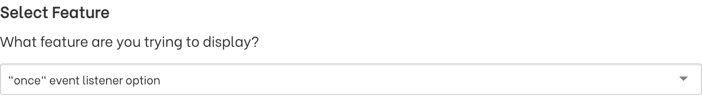
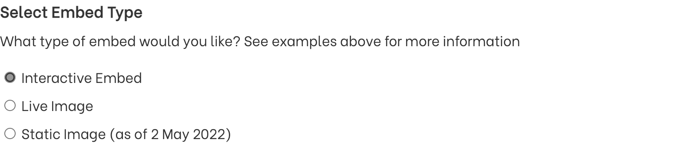
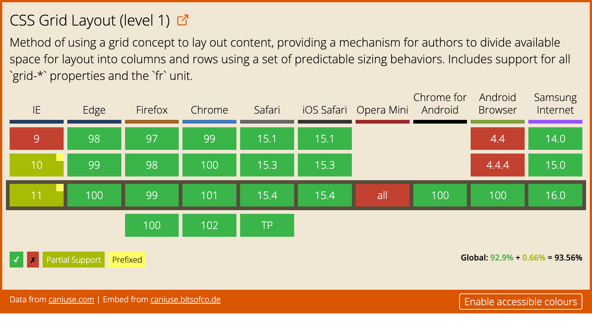
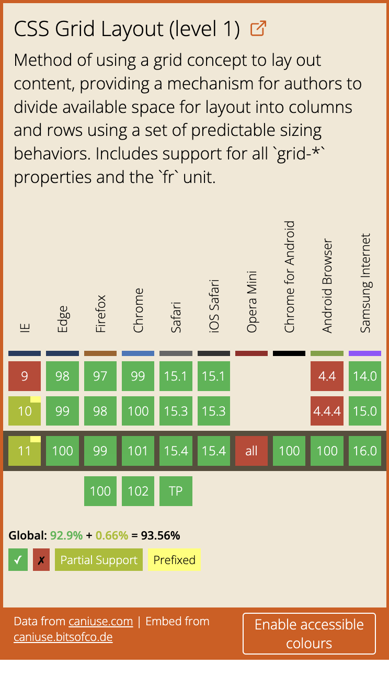
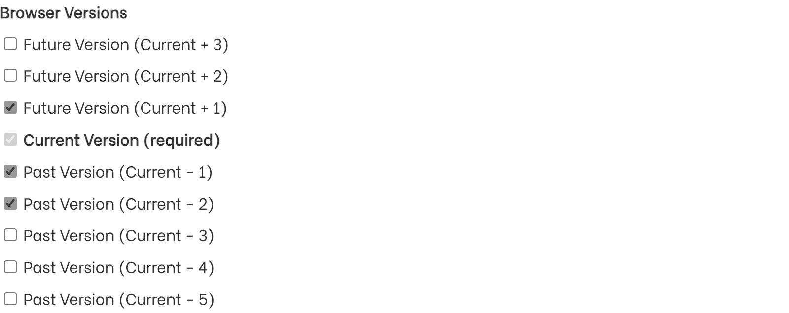
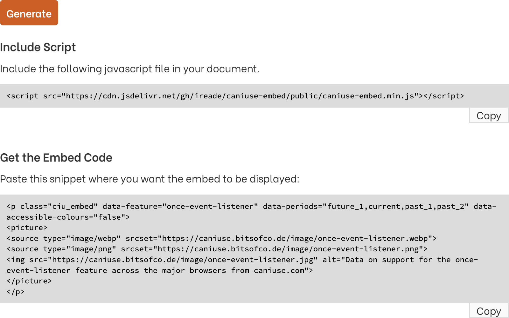

<!--
title:   The CanIUse Embedが便利
tags:    CSS,caniuse
-->

## この記事の概要

HTMLやCSSの各ブラウザでのサポート状況を調べるために[Can I use...](https://caniuse.com/)を使う場面は多いと思います。

共有のためにスクリーンショットを撮ることもあると思いますが、よりリッチに埋め込める[The CanIUse Embed](https://caniuse.bitsofco.de/)を紹介します。

## サイトの説明

以下の3パターンの埋め込み用コンテンツを生成できます。

- マウスオーバーでブラウザの使用率まで確認できる、インタラクティブな最新情報
- 1日に1回更新される、静的画像の最新情報
- 画像生成時点の日付に準拠した、スナップショット

## 埋め込みコンテンツの作り方

サイトを見ればほぼ使い方は分かると思いますが、一応説明します。

### Create your Embed

ページ上部は生成できるコンテンツの例が載っているだけなので、ページの下の方までスクロールします。
`Create your Embed`以下が実際に埋め込みコンテンツを生成するエリアです。

### Select Feature

埋め込みたいHTMLやCSSの要素を選びます。
`select`の見た目をしていますが、直接文字列を打ち込めば大丈夫です。

### Select Embed Type

3種類の中から選択します。

| 名前 | 機能 |
| --- | --- |
| Interactive Embed | Can I use...の該当のページへ飛べる。 マウスオーバーでブラウザのバージョンごとの使用率が表示される。 アクセシブルなカラーへ変更できる。 モバイルから表示すると見た目が最適化される。 |
| Live Image | 単なる画像なのでJavaScriptの使えない場所でも埋め込める。 1日に1回更新される。 拡張子は`png`, `webp`, `jpg`から選べる。 |
| Static Image | `as of ~`の日付のスナップショット。 日付は画像右下に記載されている。 |

| Desktop用の見た目 | Mobile用の見た目 |
| --- | --- |
|  |  |

### Browser Versions

表示する情報のうち、過去のバージョン数、未来のバージョン数を指定できる。
デフォルトでは過去2バージョンと未来の1バージョン。

Live Imageは非対応。

### Default Colour Scheme

Can I use...に準拠した色か、アクセシブルなカラースキームかを選べる。

Live Imageは非対応。

### Generate

選んだ形式にあわせて埋め込み用コードが出力されます。

Interactive Embedではscriptタグとセットで、Live ImageとStatic Imageではpictureタグのみ。

## まとめ

- [The CanIUse Embed](https://caniuse.bitsofco.de/)から埋め込み用のブラウザサポート一覧が取得できる
- `Interactive Embed`, `Live Image`, `Static Image`の3種類の生成方法がある
- いくつかオプションがあり、生成する内容をカスタムできる

---

最後まで読んでくださってありがとうございます！
Twitterでも情報を発信しているので、良かったらフォローお願いします！

https://twitter.com/xrxoxcxox
