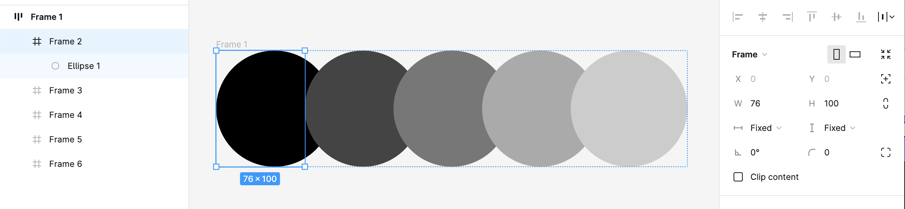

<!--
title:   2022年5月現在 Figmaで実施しない方が良いハック
tags:    figma,tips
id:      df8752598b4000a3b02d
private: false
-->

## この記事の概要

[Figma](https://www.figma.com/)は最近注目を集めているデザインツールです。

アップデートが早いのも特徴の1つなのですが、結果的に「以前は有用だったハックが今ではアンチパターン」になり得ます。

2022年5月11日に実施されたアップデートを踏まえ、それ以前に紹介されていたテクニックのうち、今はもう実施しない方が良いものをまとめました。

将来、ここで紹介したようなハックが検索でヒットして「なんだこれ？不要では？」と感じる人も出てくるでしょうから、経緯を知れるための記事になれば良いなと思っています。

## 一辺だけのborderを再現するのにDrop shadowを使う

これまでFigmaでborderを指定する場合、四辺すべてに一律で適用されていました。
そのため、一辺だけにborderを指定したい場合は`Blur`や`Spread`を0にしたDrop shadowをかけて再現しているケースがありました。

アップデートにより、一辺だけのborderが正式にサポートされたのでもうこのテクニックを使う必要は無いでしょう。

## 幅や高さが0pxのFrameを作って絶対位置で配置する

いかにもハックっぽいやり方なので、詳細は説明しません。
もし気になる方がいれば、かつて紹介のために書いた以下の記事をどうぞ。

https://qiita.com/xrxoxcxox/items/cd27f7384793d2896f47#width%E3%82%84height%E3%81%AB0001%E3%81%A8%E5%85%A5%E5%8A%9B%E3%81%99%E3%82%8B%E3%81%A8%E5%B9%85%E3%82%84%E9%AB%98%E3%81%95%E3%81%8C0%E3%81%AB%E3%81%AA%E3%82%8B

そこまで詳しくない人からしたら不可解な挙動でしょうし、実はデータとしては0pxでないため多用すると問題がおきます。

https://qiita.com/xrxoxcxox/items/f6a18bfc292848c5b78a

アップデートにより、絶対位置指定がサポートされたのでこちらを使いましょう。

## Auto layout内でネガティブマージンを再現するために小さいFrameで囲う

かつてAuto layoutの`Spacing between items`にはマイナスの値を指定できませんでした。
そのため使っていたテクニックです。
とは言え、そんなにたくさん見かけたことはありませんが笑

画像では、直径100pxの円を76pxのFrameで囲んで、その上でAuto layoutをかけています。
Frameを基準に並べられるのと、Frameからはみ出していても描画できるFigmaの特徴をあわせたテクニックでした。

しかし、公式にマイナスの値がサポートされたのでもう使う必要はありません。

## 最後に

Figmaのアップデートはいつも良い内容なので大歓迎ですが、追従できていないと`今となっては謎の作り方をしているデータ`がたくさん生まれかねません。

そもそもデザインデータをどこまで綺麗にするのか？という問題はありますが、それなりにmigrateしておいた方が後々楽な気がします。